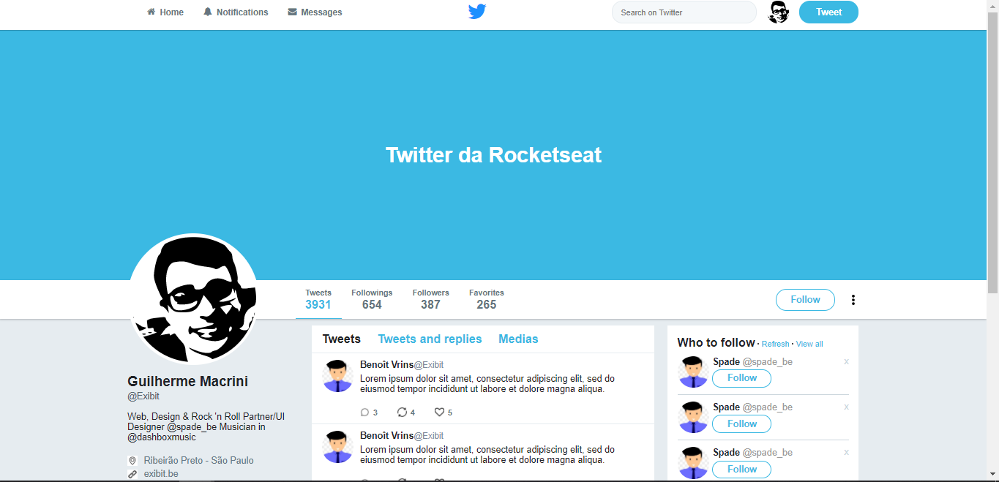

# twitter

<!--- Descrição do Projeto-->

Cópia da interface do Twitter. Projeto feito para treinar conceitos do flexbox 

 

## 🛠 Tecnologias

- [CSS](https://developer.mozilla.org/pt-BR/docs/Web/CSS)
- [HTML](https://developer.mozilla.org/pt-BR/docs/Web/HTML)
   

## Tela

 

 

## Lista de tarefas

- [x] Header
- [x] Banner
- [x] Barra superior
- [x] Profile
- [ ] Widgets
- [ ] Timeline
